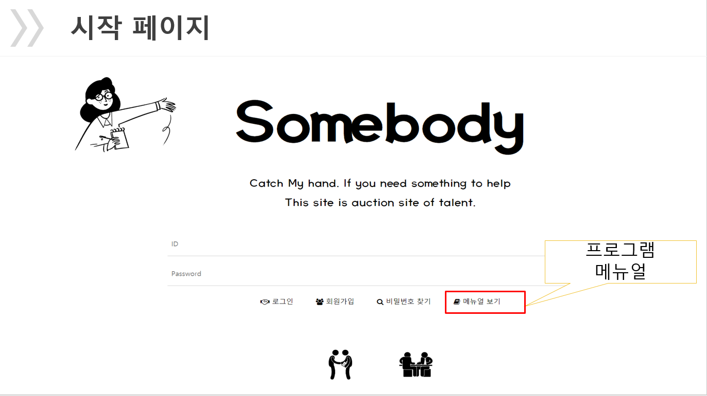
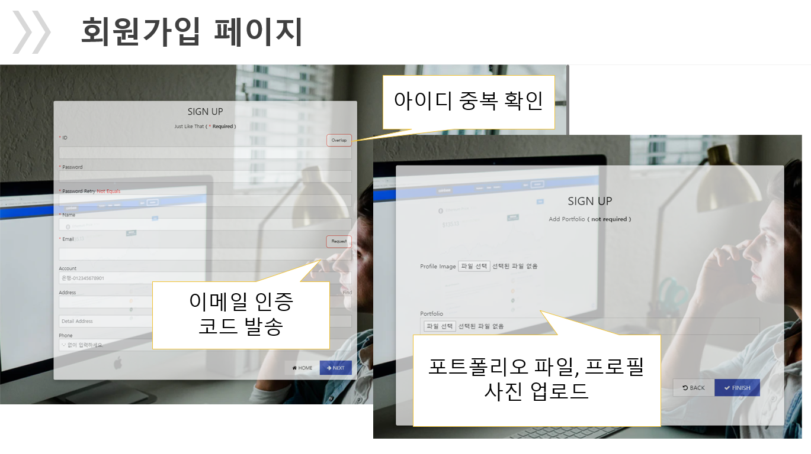
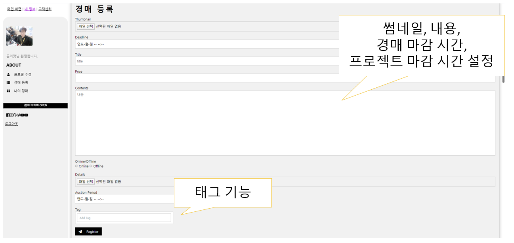
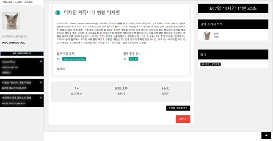
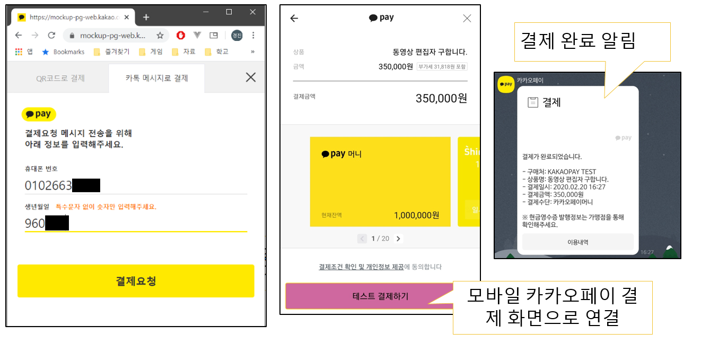
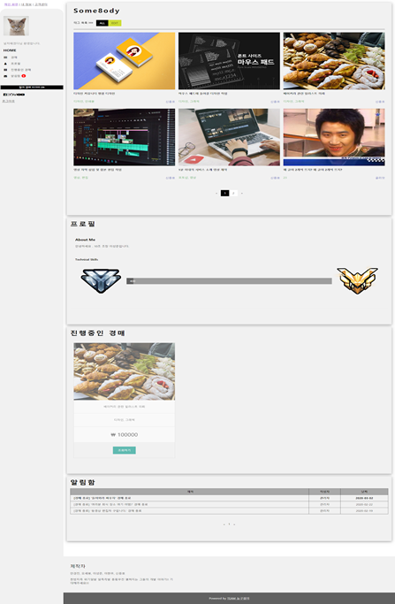

# 재능 역경매 서비스(Somebody)

> 사용자들이 가지고있는 재능을 경매 시스템을 통해 거래하는 서비스

기존의 경매 시스템(판매)이 아닌 역경매 시스템(구메)을 통해 사고자하는 재능을 글로 등록하여 구매하는 반응형 웹 서비스입니다.

**Ref [sub2](https://github.com/DDD05/S02P12D110.git)**

## 기능 리스트

- 회원 가입은 이메일 인증을 통해서만 가입이 가능하고, 입력 폼에 포트폴리오 파일과 프로필 사진 등록이 가능합니다.
- 경매 등록시 두가지 시간을 설정 가능합니다.
    - 경매 마감 시간: 경매가 진행되는 타이머를 설정
    - 재능 발현 시간: 의뢰한 재능을 수행해내는 기간
- 사이드 바를 통해 현재 내가 참여한 경매의 타이머를 확인 가능합니다.
- 재능을 판매하는 판매자의 경우 자신의 재능이 정해진 만큼 검색 버튼대신 태그 등록 방식을 이용하여 등록된 경매 내용을 검색합니다.
- 결제 시스템은 카카오페이를 통해 구매자와 판매자가 거래하며 거래 성사 후에는 구매자는 판매자에게 경험치를 부여하는 사이트의 신뢰도를 높이도록 하였습니다.

## Overview

- node.js
- vue.js
- spring boot (maven)
- docker


## Prerequisites

Make sure you have installed all of the following prerequisites on your development machine:

 - Git - [Download & Install Git](https://git-scm.com/downloads). OSX and Linux machines typically have this already installed.
 - Node.js - [Download & Install Node.js](https://nodejs.org/en/download/) and the npm package manager. If you encounter any problems, you can also use this [GitLab Issue](https://lab.ssafy.com/webmobile1-sub1/s02p11d152/issues) to install Node.js.
 - Spring boot - [Spring boot](https://start.spring.io/) create new project
 - Docker - docker hub [install](https://hub.docker.com/?overlay=onboarding)


 ## Setup & Build

프로젝트를 로컬 스토리지에 저장

```bash
$ git clone https://lab.ssafy.com/webmobile1-sub3/s02p13d110.git
```

### Vue

기본적인 패키지들을 설치

``` bash
$ cd s02p13d110/front/somebodyhelpme
$ npm install 
```

프로젝트를 빌드

```bash
$ npm run build
```

### Spring boot

프로젝트 static 디렉토리 아래에 dist 하위 Files을 붙어넣는다.
`Spring boot project`를 `build(package)`한다.


## Run

### Vue

로컬에서 프로젝트 실행

```bash
$ cd s02p13d110/front/somebodyhelpme
$ npm run serve
```

### Spring boot 

스프링 부트 프로젝트 

```bash
$ Run s02p13d110\back\Somebody\src\main\java\com\ssafy\somebody\SomebodyApplication.java
```

##### Test ID
테스트 접속 계정
```text
ID : qwe
PWD : qwe
```

## Depoly

### Docker

Docker DB Container 생성

```bash
$ docker run -d -p 9999:3306 -e MYSQL_ROOT_PASSWORD=input_password --name mariadb mariadb:10.3

$ docker run -d -it -p 80:8888 --name "springboot" dhzm2aud/springboot:1.2.4 /bin/bash
~# cd /root
~# java -jar somebody-0.0.1-SNAPSHOT.jar
```

## Design







